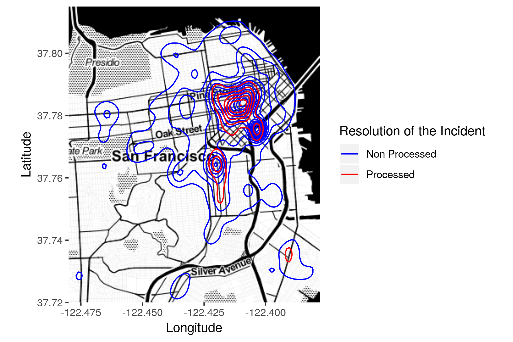

**Authors**: *Ian Flores Siaca & Betty Zhou*

```{r, include=FALSE}
knitr::opts_chunk$set(echo = FALSE, fig.width = 6, fig.height = 6)
```



*Figure 1. A plot showing the distribution of the resolution of incidents reported in San Francisco. *

## Introduction

With the past Midterms elections in San Francisco, we could observe the debate between candidates of the Republican Party and the Democratic Party about how the city should handle crime. Based on this debates that not only influence San Francisco, we decided to ask, what are the strongest predictors for whether a crime instance in San Francisco resulted in being processed by the justice system or not? For this we used the San Francisco crime dataset provided by the city of San Francisco. This dataset includes incidents reported to the San Francisco Police Department. There were two ways of submitting an incident report, either a police officer submitted one or one individual could do it as well. The dataset contains incidents reported from 2003 to 2018. To access it, we need it to submit a query to the API and as such decided to only request 100,000 cases. Each incident contains information about the category of the crime being reported, the description of the crime, the day of the week (i.e Monday, Tuesday, etc.), the date, the time, the police district as of July 18, 2015, the crime resolution and the latitude and longitude of where the incident occured. From the datestamp, we extracted the month and the day as features, but not the year, to see if there were any seasonal patterns ocurring. From the text description provided, we extracted 50 features (i.e words) to be used as well. 

## Results

After fitting the decision tree classifier, we can observe that the main features for predicting whether a person will be processed or not by the justice system in San Francisco, are the description, the crime category, the time and the location. To calculate this importance we are using the Gini importance. 

```{r}
features <- read.csv('../data/feature_results.csv')
features$X <- NULL
features <- features[order(features$feature_importance, decreasing = TRUE), ]
model_accuracy <- features[features$features == 'TEST_ACCURACY', "feature_importance"]
features <- features[features$features != 'TEST_ACCURACY', ]
```

#### Top Features

```{r}
knitr::kable(features, digits = 4, row.names = FALSE, col.names = c('Feature', 'Importance'))
```

*Table 1. Top features of the decision tree classifier for San Francisco Crime Data *

If we evaluate the performance of our model we can see that it has an accuracy of around 8 out of 10. This means that for every 10 people we predict, we are going to predict correctly for 8 individuals. 

```{r}
knitr::kable(data.frame(list(paste0(model_accuracy*100, '%')), row.names = c('Testing Accuracy')), col.names = c(''), align = 'r')
```

## References

Data - https://data.sfgov.org/Public-Safety/Police-Department-Incident-Reports-Historical-2003/tmnf-yvry

San Francisco Debates - https://www.nytimes.com/2018/06/06/us/-homelessness-housing-san-francisco.html