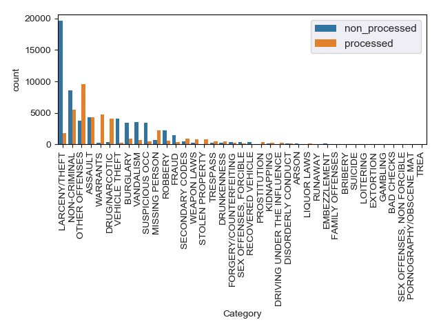

San Francisco Report
================
Authors: Ian Flores Siaca & Betty Zhou

-   [1.0 Introduction](#introduction)
-   [2.0 Dataset](#dataset)
-   [3.0 Exploratory Data Analysis](#exploratory-data-analysis)
-   [4.0 Analysis Workflow](#analysis-workflow)
-   [5.0 Analysis & Results](#analysis-results)
-   [6.0 Assumptions](#assumptions)
-   [7.0 Limitations and Future Directions](#limitations-and-future-directions)
-   [8.0 References](#references)

1.0 Introduction
----------------

With the past Midterms elections in San Francisco, we could observe the debate between candidates of the Republican Party and the Democratic Party about how the city should handle crime. Based on this debates that not only influence San Francisco, we decided to ask, what are the strongest predictors for whether a crime instance in San Francisco resulted in being processed by the justice system or not? For this we used the San Francisco crime dataset provided by the city of San Francisco. This dataset includes incidents reported to the San Francisco Police Department. There were two ways of submitting an incident report, either a police officer submitted one or one individual could do it as well. The dataset contains incidents reported from 2003 to 2018. To access it, we need it to submit a query to the API and as such decided to only request 100,000 cases. Each incident contains information about the category of the crime being reported, the description of the crime, the day of the week (i.e Monday, Tuesday, etc.), the date, the time, the police district as of July 18, 2015, the crime resolution and the latitude and longitude of where the incident occured. From the datestamp, we extracted the month and the day as features, but not the year, to see if there were any seasonal patterns ocurring. From the text description provided, we extracted 50 features (i.e words) to be used as well.

#### 1.1 Project Objective

The goal of this project is to implement a classification of the San Francisco crime data with a decision tree to predict the resolution of a crime instance. The resolution of a crime instance can be either "processed" or "non-processed". Processed indicates that a crime instance resulted in a subject being processed into the justice system.

This project will address the following predictive question: What are the strongest predictors for whether a crime instance in San Francisco resulted in an a "processed or non-processed" resolution?

2.0 Dataset
-----------

The San Francisco crime dataset used in this projects contains 10 features. A preview of the dataset is shown below:

| category       | dayofweek | descript                       | pddistrict | resolution     |  time|          x|         y|  report\_month|  report\_day|
|:---------------|:----------|:-------------------------------|:-----------|:---------------|-----:|----------:|---------:|--------------:|------------:|
| LARCENY/THEFT  | Tuesday   | PETTY THEFT FROM LOCKED AUTO   | NORTHERN   | non\_processed |   375|  -122.4211|  37.78500|              6|           28|
| ASSAULT        | Monday    | BATTERY                        | INGLESIDE  | processed      |   712|  -122.4216|  37.74300|             10|           10|
| LARCENY/THEFT  | Monday    | GRAND THEFT FROM UNLOCKED AUTO | CENTRAL    | processed      |  1120|  -122.4180|  37.80269|              7|           18|
| OTHER OFFENSES | Wednesday | PROBATION VIOLATION            | PARK       | processed      |  1075|  -122.4534|  37.76871|              9|            7|
| NON-CRIMINAL   | Friday    | CIVIL SIDEWALKS, VIOLATION     | MISSION    | processed      |   738|  -122.4142|  37.75489|              6|           24|
| OTHER OFFENSES | Wednesday | TRAFFIC VIOLATION              | INGLESIDE  | processed      |  1105|  -122.4418|  37.71543|              8|            3|

***Table 1. Preview of San Francisco crime dataset.***

3.0 Exploratory Data Analysis
-----------------------------

Exploratory analysis was performed on the cleaned dataset to better understand the trends of different variables in our dataset.

First, we checked the overall ratio of the resolution classes, which is the target classes for our classifer:

***Figure 1. An Overall check of the number of examples for each target class in resolution.***

The bar graph indicates a 2:1 imbalance in our target class between non-processed and processed. We plan to mitigate this imbalance in target classes by setting `class_weight = "balanced"`when building our model with `DecisionTreeClassifier` in scikit-learn. Therefore, we will keep this imbalance in mind for the remaining exploratory analysis where a 2 to 1 difference between non-processed and processed may be due to the class imbalance in the initial dataset and may not be indicative of trends in the dataset.

Next, we investigated all the predictors in the data set in relation to our target class for 100,000 crime instances. The features that were explored include: category, day of week, description, police district, time, longitude, latitude, month of report and day of report, in respect to whether the resolution of the crime instance was processed or non-processed. The features that were demonstrated to be good predictors for segregrating processed from non-processed crime resolutions are shown below.

A map of the density distribution of resolution for San Francisco crime instances was plotted below. 

***Figure 2. Density distribution of the resolution for crime incidents reported in San Francisco.*** Lines that are closer together on the density map indicate higher density.

The density distribution for non-processed and processed resolved crime instances appear to be segregrated based on longitude and latitude. The non-processed and processed crime instances occurred in locations of close proximity, but the map clearly shows the 2 resolutions to be concentrated at different longitudes and latitudes. Therefore, latitude and longitude may be strong predictors for the resolution of a crime instance in San Francisco.

***Figure 3. Bar graph of category distribution for San Francisco crime instances that resulted in a processed and non-processed resolution.***

If category is not a strong predictor for resolution, then we should see a 2:1 ratio between non-processed and processed for each class in category due to the 2:1 class imbalance in the resolution feature. From the bar graph above, there are many classes within category that do not demonstrate the 2:1 ratio between non-processed and processed, such as larceny/theft, vehicle theft, Drug/narcotic etc. Therefore, these classes within the category feature may be good predictors for whether a crime instance will result in a "processed or non-processed" resolution.

***Figure 4. Time distribution for San Francisco crime instances that resulted in a processed and non-processed resolution.***

From the histogram above, there is approximately a 2:1 ratio between non-processed and processed for each interval of time, except from approximated 200 to 300 minutes from midnight (i.e. 3AM to 5 AM). Therefore, this indicates that time may be a good predictor for the resolution of a crime instance in San Francisco.

------------------------------------------------------------------------

4.0 Analysis Workflow
---------------------

1.  Since our dataset is very skewed towards one of the classes, we recoded our target response variables from 17 classes to 2 classes to obtain a 2:1 imbalance in our final target classes. The final target response variables were "processed" and "non-processed".

2.  The following table outlines the features that were used as predictors to build the classifier:

    | Feature         | Feature Type |
    |-----------------|--------------|
    | Category        | Categorical  |
    | Description     | Categorical  |
    | Day of week     | Categorical  |
    | Time            | Continuous   |
    | Police District | Categorical  |
    | Longitude       | Continuous   |
    | Latitude        | Continuous   |

    ***Table 2. Features used to build the decision tree classifier***

    The categorical predictors were pre-processed using 2 method. The category, day of week and police district predictors were converted into dummy variables using `pandas.get_dummies`. The description predictor were pre-processed using `sklearn.feature_extraction.text.CountVectorizer` to extract the 50 most common descriptions, which were used as predictors to build the classifier.

    |            |          |           |         |          |            |            |          |           |           |
    |:-----------|:---------|:----------|:--------|:---------|:-----------|:-----------|:---------|:----------|:----------|
    | aggravated | aided    | arrest    | assault | auto     | automobile | base       | battery  | building  | burglary  |
    | case       | cocaine  | disturbed | drivers | enroute  | entry      | forcible   | grand    | license   | life      |
    | locked     | lost     | malicious | mental  | mischief | missing    | occurrence | outside  | person    | petty     |
    | possession | property | recovered | revoked | robbery  | rock       | sale       | stolen   | street    | suspended |
    | suspicious | theft    | threats   | traffic | unlawful | vandalism  | vehicle    | vehicles | violation | warrant   |

    ***Table 3. The 50 most common words extracted from the decription feature.***

3.  We will randomly split our dataset into training and validation sets at a 50:50 ratio using `sklearn.model_selection.train_test_split`.

4.  `sklearn.tree.DecisionTreeClassifier` was used to train the model. To combat the imbalance in our target classes, we used the argument `class_weight = 'balanced` within the DecisionTreeClassifier. We used a 3-fold cross-validation on our training set to find the optimal max\_depth between a k of 1 and 30. The optimal max\_depth was used to build the final model. `GridSearch` was used to automatically find the optimal max\_depth and k, which was used in training our model. Finally, the accuracy of the model was tested on the validation set using sklearn score's method.

5.  The Scikit learn `feature_importances_` attribute returned the Gini importance of each feature and was used to determine the strongest predictors for the target classes. The strongest predictors are the predictors with the highest feature\_importance.

5.0 Analysis & Results
----------------------

After fitting the decision tree classifier, we observe that the main features for predicting whether a person will be processed or not by the justice system in San Francisco, are the description, the crime category, the time and the location. To calculate this importance we are using the Gini importance.

#### Top Features

***Table 4. Top features of the decision tree classifier for San Francisco Crime Data. ***

If we evaluate the performance of our model we can see that it has an accuracy of around 8 out of 10. This means that for every 10 people we predict, we are going to predict correctly for 8 individuals.

|                  |         |
|:-----------------|--------:|
| Testing Accuracy |  82.214%|

6.0 Assumptions
---------------

The resolution target response variable initially had 17 classes in the orginal raw dataset. We recoded resolution into "processed" and "non-processed" based on the description provided by the [San Francisco Police Department](https://data.sfgov.org/Public-Safety/Police-Department-Incident-Reports-Historical-2003/tmnf-yvry). The recoding of the resolution target response could be different based on the interpretation of the descriptions provided by the police department. The resolution variable was recoded as demonstrated in the table below:

| Non-Processed                          | Processed                              |
|----------------------------------------|----------------------------------------|
| NONE                                   | ARREST, BOOKED                         |
| CLEARED-CONTACT JUVENILE FOR MORE INFO | ARREST, CITED                          |
| UNFOUNDED                              | NOT PROSECUTED                         |
| JUVENILE ADMONISHED                    | PSYCHOPATHIC CASE                      |
| EXCEPTIONAL CLEARANCE                  | JUVENILE CITED                         |
| JUVENILE DIVERTED                      | JUVENILE BOOKED                        |
|                                        | LOCATED                                |
|                                        | PROSECUTED BY OUTSIDE AGENCY           |
|                                        | COMPLAINANT REFUSES TO PROSECUTE       |
|                                        | DISTRICT ATTORNEY REFUSES TO PROSECUTE |
|                                        | PROSECUTED FOR LESSER OFFENSE          |

***Table 5. Recoding of Resolution target response variable.***

7.0 Limitations and Future Directions
-------------------------------------

Due to the time constraint of this project, we randomly subset 100,000 crime instances from the 2 million San Francisco crime dataset to train and validate our model. We also limited the analysis to include only the top 50 most frequent words in the description feature. This could have eliminated rare words that could have been good predictors in classifying the resolution of a crime instance in San Francisco.

Therefore, in order to improve our analysis, we would build our classifier on all 2 million San Francisco crime instances and look at addition classes within the description feature to better generalize our model and increase the validation score. We could also pool additional features related to crime instances, such as income information or employment rate, to determine whether there are other predictors, not in the current San Francisco dataset, that may be strong predictors for the resolution of a crime instance.

In addition, since our features are mostly categorical, it would be interesting to compare our current decision tree classifier to a naive Bernoulli Bayes classifier.

8.0 References
--------------

[Data](https://data.sfgov.org/Public-Safety/Police-Department-Incident-Reports-Historical-2003/tmnf-yvry)

[San Francisco Debates](https://www.nytimes.com/2018/06/06/us/-homelessness-housing-san-francisco.html)

[Basic Models for Supervised Learning](https://artint.info/2e/html/ArtInt2e.Ch7.S3.SS1.html)
